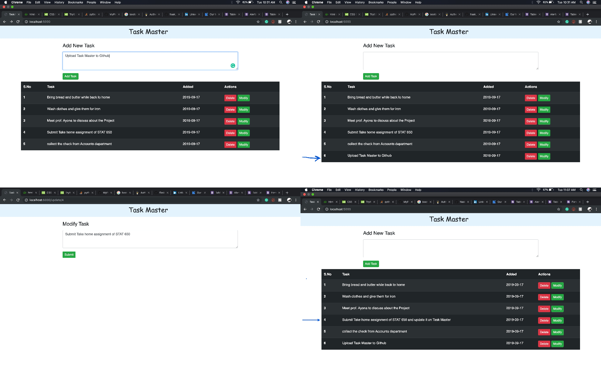

# Task-Master

  

Here Users can keep track of a list of tasks they need to do. This will start as a simple web application using Flask for the backend and SQLAlchemy for the database. Login/Signup page can be easily created if required later. This has following pages.
- Main Dashboard page
  - One section will allow the user to add a new task
  - One section displays their tasks and allow them to delete or modify them.
- Modify page
  - Since I didn't use the Frontend and renders the page from backend directly, update page is created seperately.

## Backend Milestones
- Setup Flask server to handle GET and POST requests.
- Design and implement necessary Flask routes for the application.
- Design and implement Task class and implement using Flask SQLAlchemy.
- Write unit tests for the class.

## What is a Task?
- Description of the Task
- Date it was created
- unique_id to identofy Task.
